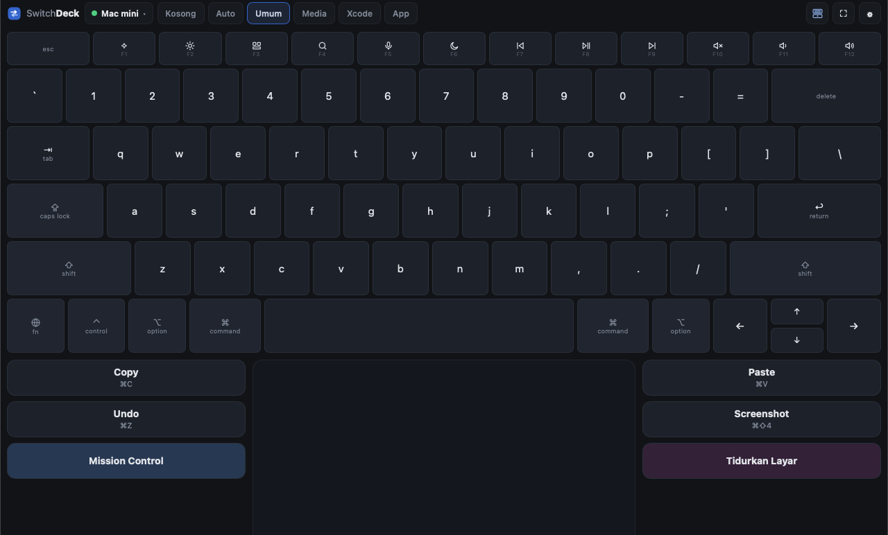
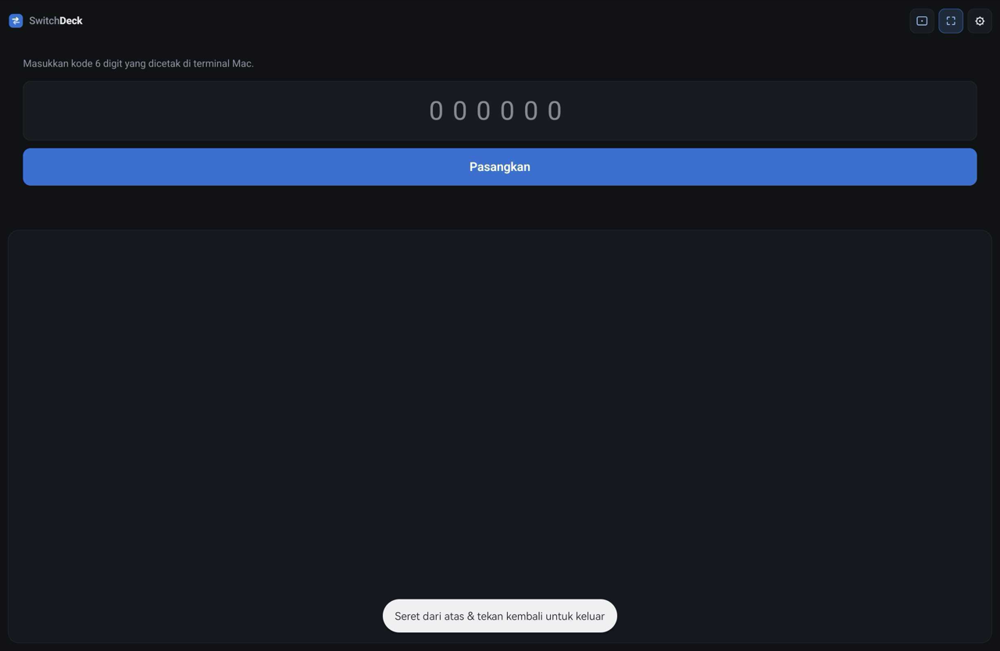
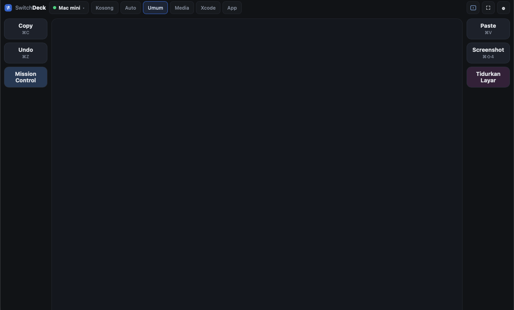
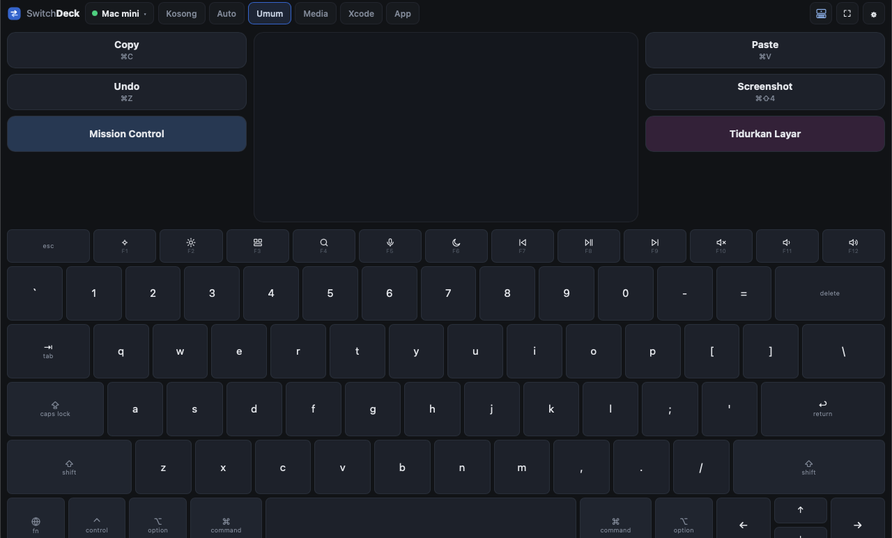
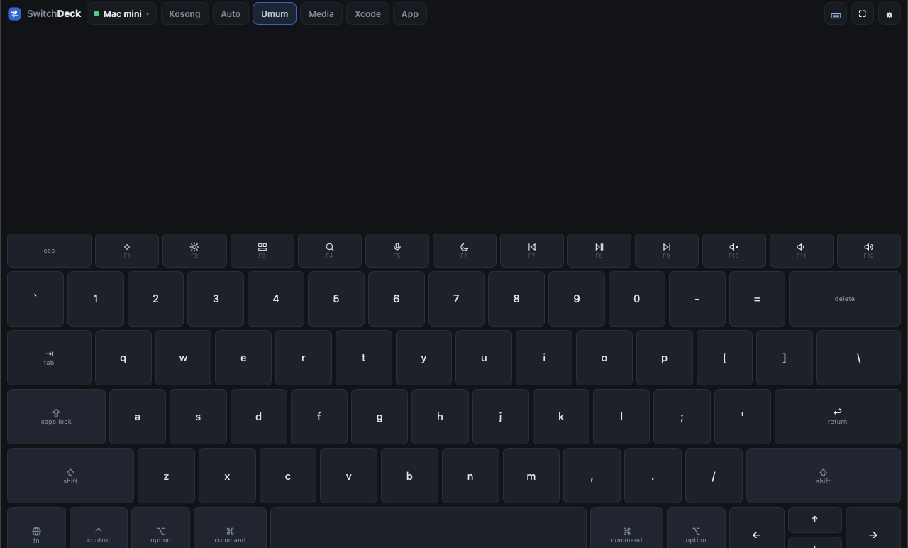
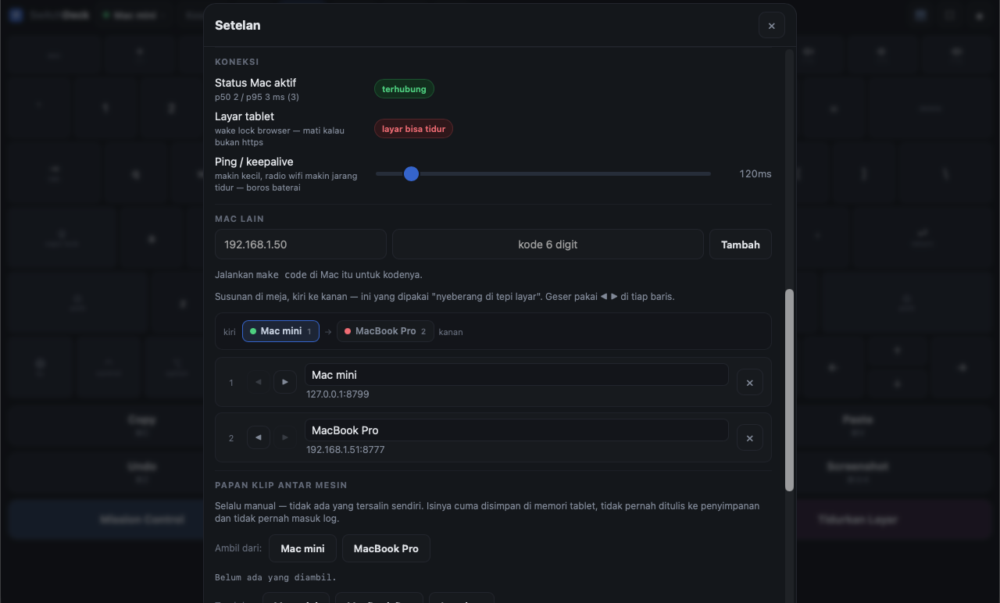
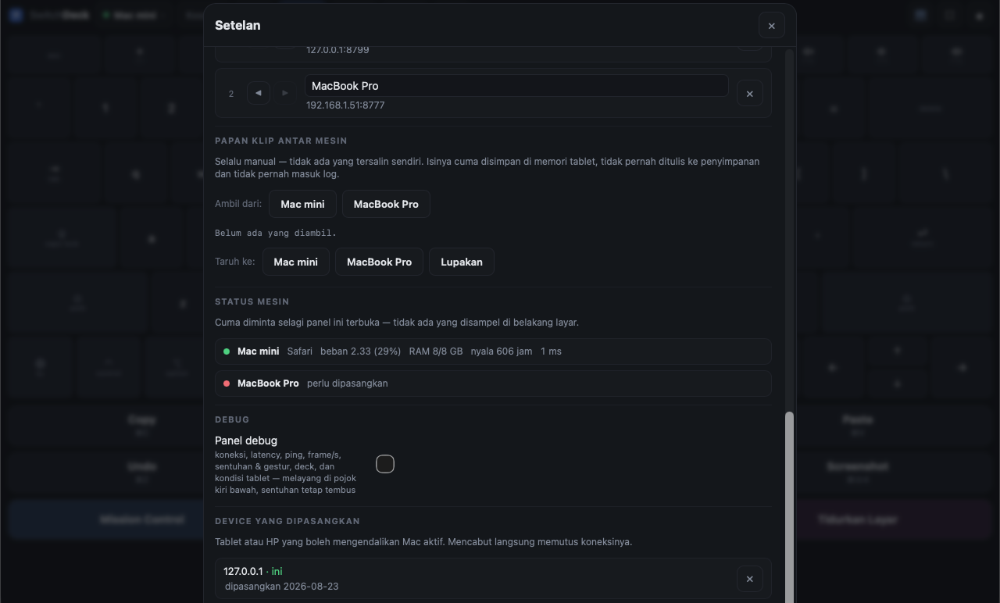
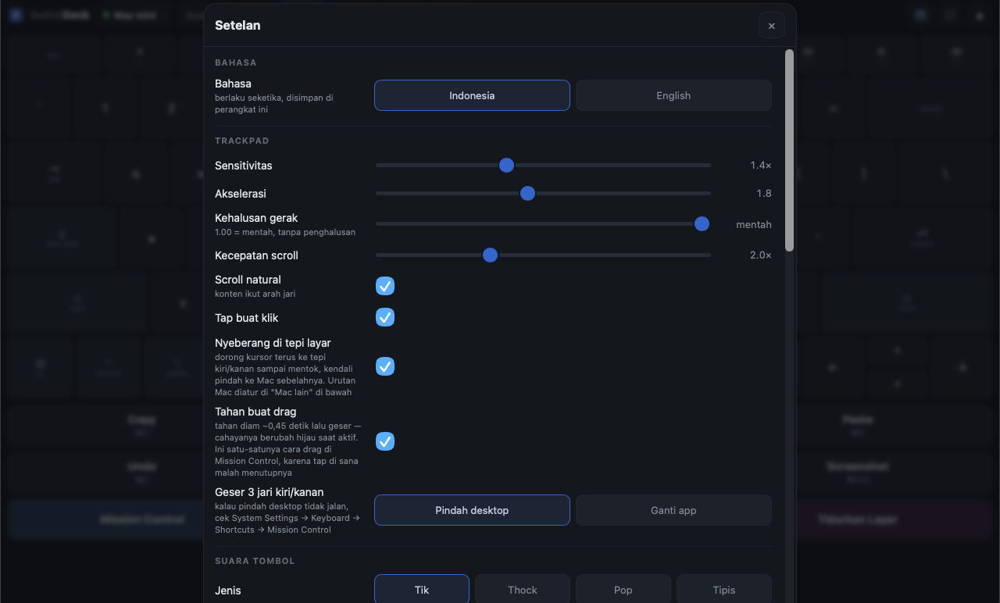
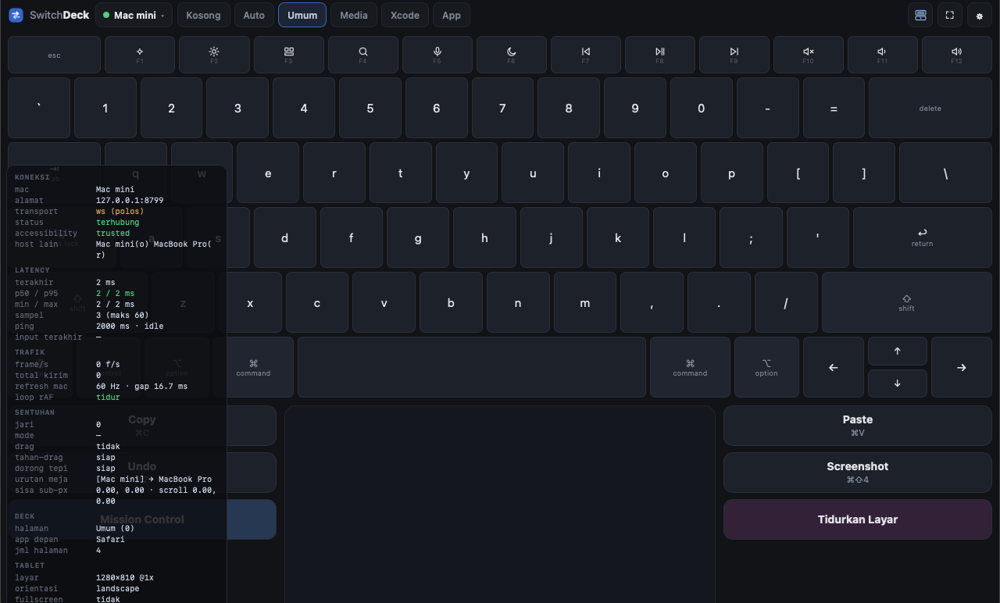

# SwitchDeck

Tablet Android jadi **trackpad + keyboard + deck makro** untuk Mac — lewat browser, tanpa install apa pun di tablet.

Satu tablet bisa menyetir **beberapa Mac sekaligus**: semua tersambung barengan, dan kendali berpindah dengan mendorong kursor ke tepi layar.



> 🇬🇧 **English:** [README.md](README.md) · 📖 Versi HTML dengan gambar lebih besar: buka **[docs/id.html](docs/id.html)** di browser.

---

## Daftar isi

1. [Apa ini, dan apa yang bukan](#apa-ini-dan-apa-yang-bukan)
2. [Yang dibutuhkan](#yang-dibutuhkan)
3. [Pasang di Mac](#pasang-di-mac)
4. [Izin macOS](#izin-macos)
5. [Sambungkan tablet (pairing)](#sambungkan-tablet-pairing)
6. [Mengenal layar](#mengenal-layar)
7. [Trackpad](#trackpad)
8. [Keyboard](#keyboard)
9. [Deck](#deck)
10. [Tata letak](#tata-letak)
11. [Beberapa Mac sekaligus](#beberapa-mac-sekaligus)
12. [Papan klip antar mesin](#papan-klip-antar-mesin)
13. [Status mesin](#status-mesin)
14. [Setelan](#setelan)
15. [Panel debug](#panel-debug)
16. [Pasang ke layar depan (PWA) & HTTPS](#pasang-ke-layar-depan-pwa--https)
17. [Jalan otomatis saat Mac nyala](#jalan-otomatis-saat-mac-nyala)
18. [Kalau ada masalah](#kalau-ada-masalah)
19. [Daftar perintah `make`](#daftar-perintah-make)
20. [Cara kerjanya di dalam](#cara-kerjanya-di-dalam)

---

## Apa ini, dan apa yang bukan

**Ini:** permukaan kendali. Tablet mengirim gerakan, ketikan, dan id tombol; Mac yang menjalankannya.

**Bukan:**

- **Bukan screen mirroring / remote desktop.** Layar Mac tidak pernah dikirim ke tablet. Kalau butuh itu, pakai Universal Control atau VNC.
- **Bukan untuk dipakai dari luar rumah.** Dirancang untuk satu jaringan lokal.
- **Bukan produk untuk orang lain.** Tidak ada akun, tidak ada cloud, tidak ada multi-user.

---

## Yang dibutuhkan

| | |
|---|---|
| **Mac** | macOS dengan Xcode command line tools (untuk `swift build`) dan **Node.js 18+** |
| **Tablet / HP** | apa saja yang punya browser modern dan layar sentuh multi-jari |
| **Jaringan** | tablet dan Mac di **wifi yang sama**. Lewat Tailscale juga jalan, tapi latensinya lebih tinggi |

---

## Pasang di Mac

```bash
git clone https://github.com/fadielse/switch-deck.git
cd switch-deck
make build      # compile helper Swift (deckd-input)
make deps       # dependency Node untuk server (deckd)
make doctor     # cek izin & kesehatan
make deckd      # jalankan server
```

`make deckd` akan mencetak sesuatu seperti ini:

```
Buka di tablet:  http://192.168.1.213:8777/
Kode pairing:    858417
```

Biarkan terminal itu terbuka. Untuk menjalankannya otomatis tiap Mac nyala, lihat [Jalan otomatis saat Mac nyala](#jalan-otomatis-saat-mac-nyala).

---

## Izin macOS

SwitchDeck menyuntik input, jadi macOS mewajibkan izin **Accessibility**.

```bash
make doctor
```

Kalau tertulis `trusted : TIDAK`, buka:

**System Settings → Privacy & Security → Accessibility**, lalu tambahkan binary ini:

```
<folder-repo>/mac/deckd-input/.build/release/deckd-input
```

Tekan **+**, lalu di dialog file tekan **⌘⇧G** dan tempel path di atas — folder `.build` disembunyikan Finder, jadi tidak bisa diklik dari daftar biasa.

Dua hal yang sering bikin bingung:

- **Izin menempel pada aplikasi induk.** Kalau `deckd` dijalankan dari Terminal, yang perlu diizinkan bisa jadi Terminal-nya. Kalau dijalankan lewat launchd (`make install`), yang diizinkan binary-nya langsung. `make doctor` mencetak rantai prosesnya supaya kelihatan siapa induknya.
- **Setelah menambahkan izin, jalankan ulang `deckd`.** macOS tidak memberi izin ke proses yang sudah jalan.

Untuk fitur pindah desktop dan App Exposé, macOS juga akan meminta izin **Automation** (System Events) sekali saat pertama dipakai.

---

## Sambungkan tablet (pairing)

1. Buka alamat yang dicetak `make deckd` di browser tablet, misalnya `http://192.168.1.213:8777/`.
2. Masukkan **kode 6 digit** yang tercetak di terminal.
3. Tap **Pasangkan**.

Kode hanya sekali pakai dan ada rate-limit — tebakan beruntun langsung dijeda. Setelah berhasil, tablet menyimpan token-nya sendiri, jadi tidak perlu pairing lagi.

Lupa kodenya? `make code` mencetaknya lagi.



---

## Mengenal layar


Dari kiri ke kanan di bar atas:

| Bagian | Fungsi |
|---|---|
| **Logo SwitchDeck** | penanda; nama menghilang di layar sempit |
| **Chip Mac** | titik status + nama Mac yang sedang disetir. Tap untuk pindah Mac (kalau ada lebih dari satu) |
| **Tab halaman deck** | `Kosong`, `Auto`, lalu nama tiap halaman dari `deck.json`. Bisa di-scroll ke samping |
| **Tombol tata letak** | berputar antara 4 susunan; ikonnya menggambarkan susunan yang **sedang** dipakai |
| **⛶** | fullscreen |
| **⚙** | setelan |

Bar atas tingginya **tetap** — tidak pernah tumbuh walaupun nama app di tab `Auto` panjang.

---

## Trackpad

Area besar di tengah. Sentuhan dikonfirmasi oleh **cahaya lembut yang mengikuti jari** — dua jari untuk scroll berarti dua cahaya.

| Gerakan | Hasil |
|---|---|
| Satu jari geser | gerakkan kursor |
| Satu jari tap | klik kiri |
| **Dua tap cepat** | **dobel klik** — buka file, pilih kata |
| Dua jari geser | scroll |
| Dua jari tap | klik kanan |
| Tap lalu tekan lagi, geser | drag |
| **Tahan diam ~0,45 detik lalu geser** | **drag** — cahayanya berubah **hijau** saat aktif |
| Tiga jari geser kiri/kanan | pindah desktop (atau ganti app — bisa dipilih di setelan) |
| Tiga jari geser atas | Mission Control |
| Tiga jari geser bawah | App Exposé |

**Kenapa "tahan buat drag" penting:** di Mission Control, tap pertama justru *memilih window dan menutup Mission Control*, jadi gestur "tap lalu tekan" tidak akan pernah bisa dipakai di sana. Tahan-lalu-geser adalah satu-satunya cara memindahkan window antar desktop dari tablet.

Trackpad **tidak berbunyi** — dia permukaan, bukan tombol. Suara ada di keyboard dan deck, sebagai pengganti travel tombol yang tidak dimiliki kaca.

---

## Keyboard

Tata letaknya mengikuti Apple Magic Keyboard US: nama tombol sama, lebar sama, fn row setinggi dua pertiga, arrow inverted-T.

- **Modifier bersifat sticky**: tap = aktif sekali, tap lagi = terkunci, tap lagi = mati. Bisa juga **ditahan sambil menekan huruf dengan jari lain**.
- **fn row punya dua peran** seperti hardware: aksi tercetak (brightness, volume, media) secara default, dan **F1–F12 polos** kalau `fn` aktif.
- **Caps Lock** adalah toggle di tablet, bukan tombol yang dikirim — macOS memperlakukan caps sebagai state hardware yang tidak bisa disetel lewat event.
- **Tombol yang ditahan mengulang** (jeda 450 ms, lalu tiap 45 ms). Modifier dan media key sengaja tidak mengulang.
- Keluar dari mode keyboard **melepas semua modifier**, jadi tidak mungkin ada modifier nyangkut di Mac.

Ketikan dikirim sebagai **karakter apa adanya**, jadi hasilnya tidak bergantung layout keyboard di Mac. Shortcut dikirim sebagai **keycode dengan modifier benar-benar ditahan**, karena chord harus sampai sebagai chord.

---

## Deck

Tombol makro di kiri-kanan trackpad (di portrait: satu grid di atas). Isinya datang dari:

```
~/.config/switchdeck/deck.json
```

File itu dibuat otomatis saat pertama jalan, dan **halaman App-nya hanya diisi aplikasi yang benar-benar terpasang** — jadi tidak ada tombol mati.

**Edit file itu, semua tablet menggambar ulang seketika** — tanpa reconnect, tanpa restart. Salah ketik JSON akan menyisakan deck terakhir yang benar di layar plus peringatan, bukan mengosongkannya.

### Bentuk file

```json
{
  "pages": [
    {
      "name": "Umum",
      "keys": [
        { "id": "copy", "label": "Copy", "hint": "⌘C",
          "action": { "type": "shortcut", "keys": ["cmd", "c"] } },
        { "id": "sleep", "label": "Tidurkan Layar", "color": "#3a2440",
          "action": { "type": "shell", "command": "pmset", "args": ["displaysleepnow"] } }
      ]
    },
    {
      "name": "Xcode",
      "match": ["Xcode"],
      "keys": [
        { "id": "xc-build", "label": "Build", "hint": "⌘B",
          "action": { "type": "shortcut", "keys": ["cmd", "b"] } }
      ]
    }
  ]
}
```

### Field per tombol

| Field | Wajib | Arti |
|---|---|---|
| `id` | ya | nama unik; ini satu-satunya yang dikirim tablet |
| `label` | — | tulisan di tombol (default: `id`) |
| `hint` | — | baris kecil di bawah label |
| `color` | — | warna latar, misal `#2c405c` |
| `host` | — | jalankan di **Mac lain** — lihat [tombol lintas mesin](#tombol-yang-jalan-di-mac-lain) |
| `action` | ya | apa yang dijalankan |

### Tipe action

| Type | Contoh |
|---|---|
| `shortcut` | `{ "type": "shortcut", "keys": ["cmd", "shift", "4"] }` |
| `text` | `{ "type": "text", "text": "alamat@email.com" }` |
| `media` | `{ "type": "media", "code": 16 }` — kode `NX_KEYTYPE_*` (play 16, next 17, prev 18, mute 7, vol up 0, vol down 1) |
| `open_app` | `{ "type": "open_app", "app": "Xcode" }` |
| `url` | `{ "type": "url", "url": "https://github.com" }` |
| `applescript` | `{ "type": "applescript", "script": "display notification \"halo\"" }` |
| `shell` | `{ "type": "shell", "command": "pmset", "args": ["displaysleepnow"] }` |

**`shell` menerima command + array argumen, bukan satu baris perintah.** Tidak ada yang sampai ke shell untuk diurai ulang, jadi tidak ada tempat untuk injeksi.

### Halaman yang ikut app aktif

Beri halaman field `match`:

```json
{ "name": "Xcode", "match": ["Xcode", "com.apple.dt.Xcode"], "keys": [ ... ] }
```

Isinya bisa nama app atau bundle id. Lalu **pilih tab `Auto`** di tablet: deck akan mengikuti app yang sedang di depan (Xcode ke depan → halaman Xcode).

**Mengikuti app itu MODE, bukan perilaku default.** Deck yang menata ulang dirinya saat tangan sedang meraih tombol lebih buruk daripada deck yang diam. Memilih halaman = mengunci. Tab `Auto` hanya muncul kalau memang ada halaman yang minta app.

Perpindahannya di-debounce 250 ms: alt-tab melewati tiga app harus mendarat di yang terakhir, bukan berkedip lewat ketiganya.

---

## Tata letak

Tombol tata letak di bar atas berputar antara empat susunan. Ikonnya memakai satu kosakata: **dua garis = tombol, satu titik = trackpad.**

### 1. Trackpad saja



Trackpad mengambil semua ruang yang tidak dipakai deck. Kalau halaman deck disetel `Kosong`, trackpad benar-benar sepenuh layar.

### 2. Keyboard di atas, trackpad di bawah


Keyboard **menyusutkan** trackpad, bukan menggantikannya — deck tidak pernah hilang dari layar.

### 3. Trackpad di atas, keyboard di bawah



Isi yang sama, dibalik.

### 4. Keyboard saja



Trackpad hilang dan keyboard **turun ke bawah dengan ukuran yang sama** seperti mode sebelumnya — bukan melar. Keyboard yang dimelarkan sepenuh tablet punya baris lebih tinggi dari jempol, dan itu lebih susah diketik, bukan lebih enak.

Pilihan tata letak diingat per perangkat.

**Portrait ditangani terpisah.** Tablet yang berdiri itu deck yang ditegakkan, bukan laptop — palm rest di kiri-kanan trackpad tidak masuk akal di lebar segitu. Jadi begitu tablet diputar, deck otomatis jadi **satu grid di bagian atas** dan trackpad mengambil sisanya. Tidak ada yang perlu disetel; cukup putar tabletnya.

---

## Beberapa Mac sekaligus

Semua Mac tersambung **barengan**, tetapi hanya satu yang menerima input pada satu waktu. Tablet yang memegang semua koneksi — Mac tidak pernah saling bicara, jadi satu Mac mati tidak menjatuhkan yang lain.

### Menambahkan Mac kedua

Di Mac yang baru: `make deckd`, lalu `make code` untuk kodenya. Di tablet: **⚙ → Mac lain → isi alamat + kode → Tambah**.



### Urutan meja

Strip di atas daftar menggambar susunan **fisik** Mac di meja, kiri ke kanan:

```
kiri   ● Mac mini 1  →  [● MacBook Pro 2]  →  ● mini PC 3   kanan
```

Geser dengan tombol **◀ ▶** di tiap baris. Nomornya juga muncul di daftar, jadi daftar vertikal itu tidak perlu dibayangkan sebagai baris horizontal.

Urutan ini **bukan kosmetik** — ini yang dibaca fitur nyeberang di bawah.

### Nyeberang di tepi layar

Dorong kursor terus ke tepi kanan sampai mentok, dan kendali pindah ke Mac di sebelah kanannya. Kursor di Mac tujuan muncul di tepi seberangnya, di ketinggian yang sama, jadi terasa menyambung.

Supaya tidak pindah karena mentok biasa saat kerja, syaratnya **dua-duanya** harus terpenuhi: ~90 px gerakan tertelan **dan** dorongan berlanjut minimal ~0,1 detik. Ada jeda 0,7 detik setelah pindah. Bisa dimatikan di setelan.

Kalau tidak mau pindah, **panel debug menyebut sebabnya** (`nyeberang gagal`): tidak ada Mac di sisi itu, atau Mac-nya tidak terhubung.

### Tombol yang jalan di Mac lain

Beri sebuah tombol deck field `host`:

```json
{ "id": "build", "label": "Build", "host": "MacBook Pro",
  "action": { "type": "shortcut", "keys": ["cmd", "b"] } }
```

Tombol itu selalu jalan di Mac yang disebut, apa pun yang sedang disetir — build di Mac mini sambil terus mengetik di MacBook.

Dua hal yang mengikuti dari aturan "tablet cuma kirim id":

- **Id-nya diresolusi di mesin tujuan.** `host: "MacBook Pro"` berarti *"jalankan macro bernama `build` di sana"*, dan `deck.json` milik MacBook yang menentukan `build` itu apa. Tiap mesin tetap pemilik arti id-nya sendiri.
- **`action` di sebelah `host` adalah yang jalan lokal**, di mesin pemilik file ini. Tidak pernah dikirim ke mana pun.

`host` dicocokkan dengan nama yang tampil di daftar Mac (atau alamatnya). Tombolnya digambar **bergaris putus-putus** dengan nama mesin tujuan, dan **redup** kalau mesin itu tidak terhubung.

---

## Papan klip antar mesin

**⚙ → Papan klip antar mesin.**



- **Ambil dari** Mac X → isinya disimpan di tablet.
- **Taruh ke** Mac Y → isinya ditulis ke papan klip Mac itu.

**Selalu manual, tidak pernah otomatis.** Sync papan klip otomatis antar mesin terdengar seperti kenyamanan dan sebenarnya kebocoran — password manager menaruh password di papan klip, dan menyalinnya ke mesin lain tanpa diminta tidak kelihatan sampai terlambat.

Batasnya: **teks saja**, maksimal 16 KB, disimpan di **memori tablet saja** (hilang saat reload, tidak pernah menyentuh penyimpanan), dan **tidak pernah masuk log** di titik mana pun.

---

## Status mesin

**⚙ → Status mesin.** Satu baris per Mac: app yang sedang di depan, beban, memori, lama nyala, latency, dan apakah Accessibility sudah diizinkan.

**Beban ditampilkan per core** karena itu angka yang artinya sama di laptop 4-core dan desktop 12-core — dan itu justru gunanya halaman ini. Warnanya berubah kuning di atas 70%.

Datanya **hanya diminta selagi panel setelan terbuka**. Tidak ada yang disampel di belakang layar.

---

## Setelan



**Bahasa antarmuka** ada di paling atas panel setelan: Indonesia atau English, berlaku seketika tanpa reload.

Yang **tidak** ikut berubah — dan memang tidak boleh: **nama halaman deck dan label tombol deck**. Semua itu datang dari `deck.json` milik Mac, bukan dari aplikasi. Kalau tombol lo bertuliskan "Tidurkan Layar", dia tetap begitu di mode English, karena itu tulisan lo sendiri.

| Setelan | Arti |
|---|---|
| **Bahasa** | Indonesia atau English. Berlaku seketika, disimpan per perangkat |
| **Sensitivitas** | pengali gerakan kursor |
| **Akselerasi** | seberapa jauh gerakan cepat melipatgandakan jarak |
| **Kehalusan gerak** | `1.00` = mentah tanpa penghalusan; makin kecil makin halus tapi menambah 1–2 frame jeda |
| **Kecepatan scroll** | pengali scroll dua jari |
| **Scroll natural** | konten mengikuti arah jari |
| **Tap buat klik** | matikan kalau sering salah klik |
| **Nyeberang di tepi layar** | serah-terima kursor antar Mac |
| **Tahan buat drag** | tahan diam lalu geser untuk drag |
| **Geser 3 jari kiri/kanan** | *Pindah desktop* atau *Ganti app* |
| **Suara tombol** | jenis (Tik / Thock / Pop / Tipis) dan volume; `0` = mati. Trackpad memang tidak berbunyi |
| **Pasang ke layar depan** | lihat bagian PWA di bawah |
| **Ping / keepalive** | makin kecil, radio wifi makin jarang tidur — lebih boros baterai. Saat menganggur, ping otomatis melambat ke 2 detik |
| **Mac lain** | tambah, beri nama, urutkan, hapus |
| **Papan klip antar mesin** | ambil / taruh |
| **Status mesin** | kondisi tiap Mac |
| **Panel debug** | lihat bawah |
| **Device yang dipasangkan** | tablet/HP yang boleh mengendalikan Mac aktif; mencabut langsung memutus koneksinya |

Semua setelan disimpan per perangkat.

---

## Panel debug

**⚙ → Debug → Panel debug.** Melayang di pojok kiri bawah, **sentuhan tetap tembus** ke bawahnya.



| Grup | Isi |
|---|---|
| **koneksi** | Mac aktif, alamat, transport (ws/wss), status, izin Accessibility, ringkasan Mac lain |
| **latency** | rtt terakhir, p50/p95 (berwarna sesuai ambang), min/max, jumlah sampel, mode ping aktif/idle |
| **trafik** | frame/detik, total kirim, refresh Hz Mac, status loop animasi |
| **sentuhan** | jumlah jari, mode, drag, jarak gestur vs ambang, sisa sub-piksel |
| **deck** | halaman aktif, app depan, jumlah halaman |
| **tablet** | ukuran layar, orientasi, fullscreen, wake lock, secure context, status audio |

Saat mati, panel ini **tidak memakan apa pun** — timer-nya hanya ada selama panel terbuka.

Kalau sesuatu tidak jalan, mulai dari sini. Dua baris yang paling sering menjawab:

- **`nyeberang gagal`** — kenapa serah-terima kursor tidak terjadi.
- **`injector nolak`** — Mac itu menolak sebuah frame. Hampir selalu berarti binary Swift di mesin itu lebih lama dari client-nya (`git pull` tanpa `make build`).

---

## Pasang ke layar depan (PWA) & HTTPS

**⚙ → Pasang ke layar depan.** Berjalan tanpa bar browser, dibuka lewat ikon seperti aplikasi biasa.

Kalau tombolnya tidak muncul, panelnya menyebutkan alasannya — bukan menampilkan tombol mati. Di sebagian browser jalurnya lewat menu ⋮ → *Add to Home screen*.

**HTTPS itu peningkatan, bukan syarat.** Aplikasi disajikan di dua port sekaligus:

```
http://<ip>:8777/      selalu ada
https://<ip>:8778/     setelah `make cert`
```

Kenapa perlu? **Wake Lock** (menahan layar tablet tetap menyala) hanya jalan di secure context. Jadi kalau layar tablet suka tidur sendiri, itu tandanya sedang lewat HTTP.

```bash
make cert     # bikin sertifikat lokal
# lalu restart deckd, dan di tablet buka https://<ip>:8778/
```

Halaman `/setup` di server memandu pemasangan sertifikat CA di tablet.

---

## Jalan otomatis saat Mac nyala

```bash
make install      # pasang sebagai layanan launchd
make status       # cek jalan atau tidak
make uninstall    # cabut lagi
```

**Penting:** launchd tidak punya aplikasi induk yang bisa "meminjamkan" izin Accessibility-nya. Jadi binary `deckd-input` harus diizinkan **langsung**, bukan Terminal. `make doctor` mencetak rantai proses supaya jelas siapa yang sebenarnya perlu dicentang.

---

## Kalau ada masalah

| Gejala | Kemungkinan besar |
|---|---|
| Kursor tidak bergerak sama sekali | Izin Accessibility. Jalankan `make doctor` — kalau `trusted: TIDAK`, izinkan lalu **jalankan ulang** deckd |
| Tablet tidak bisa membuka alamatnya | Beda jaringan, atau firewall Mac. Cek dengan `make ip` |
| Kode pairing selalu salah | Kode sekali pakai. Ambil yang baru dengan `make code` |
| Layar tablet tidur terus | Sedang lewat HTTP. Wake Lock butuh HTTPS — `make cert` |
| Satu fitur jalan di satu Mac tapi tidak di Mac lain | Mac itu belum di-`make build` setelah `git pull`. Panel debug akan menampilkan `injector nolak` |
| Nyeberang di tepi tidak terjadi | Cek urutan meja di **⚙ → Mac lain**, dan baris `nyeberang gagal` di panel debug |
| Gestur tiga jari tidak pindah desktop | Cek *System Settings → Keyboard → Shortcuts → Mission Control* masih aktif |
| Muncul popup asing saat menahan dua jari | Itu fitur browsernya, bukan SwitchDeck. Coba browser lain — misalnya Vivaldi di Android memunculkan popup QR yang tidak bisa ditekan oleh halaman |
| Dobel tap tidak membuka apa-apa | Pastikan `make build` sudah dijalankan; perbaikan click count ada di sisi Swift |

Masih buntu? Nyalakan **panel debug** dan baca grup `koneksi` — hampir semua pertanyaan "kenapa diam" terjawab di situ.

---

## Daftar perintah `make`

| Perintah | Fungsi |
|---|---|
| `make build` | compile helper Swift |
| `make deps` | install dependency Node |
| `make deckd` | jalankan server |
| `make doctor` | cek izin, rantai proses, kesehatan |
| `make code` | cetak ulang kode pairing |
| `make ip` | alamat Mac di jaringan lokal |
| `make cert` | buat sertifikat untuk HTTPS |
| `make install` / `make uninstall` | pasang / cabut layanan launchd |
| `make status` | status layanan |
| **Tes** | |
| `make e2e` | rantai penuh WebSocket → deckd → deckd-input |
| `make client` | semua cek sisi client (tanpa Mac, tanpa build, tanpa izin) |
| `make idle` | memastikan client membiarkan CPU tidur |
| `make debug-panel` | memastikan panel debug tergambar di semua kondisi |
| `make dblclick` | memastikan dobel tap jadi dobel klik sungguhan |
| `make selftest` | uji injeksi input langsung |
| `make verify-copy` | uji rantai penuh sampai clipboard macOS |
| `make latency` | ukur latency |

---

## Cara kerjanya di dalam

```
Tablet (browser)  ──WebSocket──▶  deckd (Node)  ──stdin JSON──▶  deckd-input (Swift)  ──▶  macOS
                                    │                                                       CGEvent
                                    └── deck.json, token device, pairing
```

Tiga proses, tiga tanggung jawab:

- **Client web** — semua UI. Diedit paling sering, tidak perlu compile.
- **`deckd` (Node)** — router: WebSocket, token, deck, validasi. **Tidak tahu apa itu CGEvent.**
- **`deckd-input` (Swift)** — satu-satunya yang menyentuh API macOS. Semua kode khusus OS dikurung di sini, supaya menambah Windows nanti tidak menyentuh dua lapisan lainnya.

Aturan yang berlaku sejak awal dan tidak pernah dilonggarkan: **tablet mengirim id, bukan perintah.** Tablet tidak pernah tahu isi `action` sebuah tombol; dia hanya tahu id dan label. Setiap frame divalidasi di `deckd` sebelum diteruskan — angka tidak berhingga, keycode di luar jangkauan, nama modifier ngawur, dan teks kepanjangan semuanya ditolak, bukan diam-diam diperbaiki.
