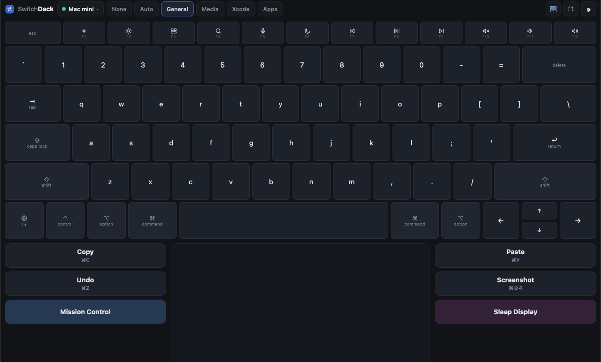
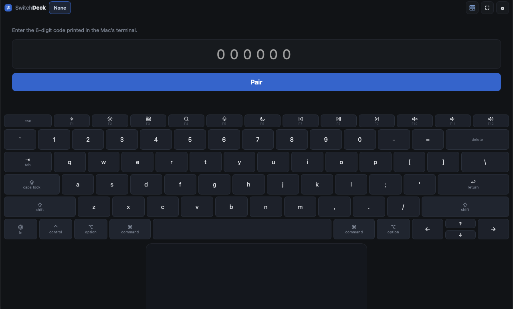
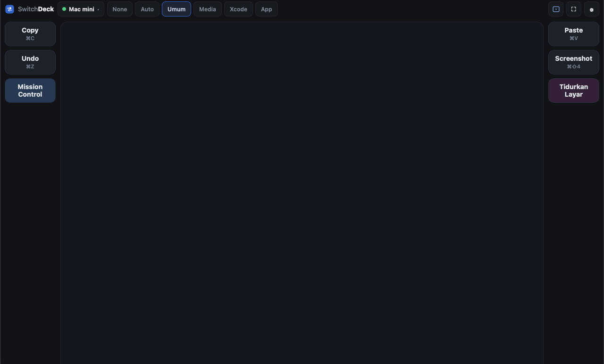
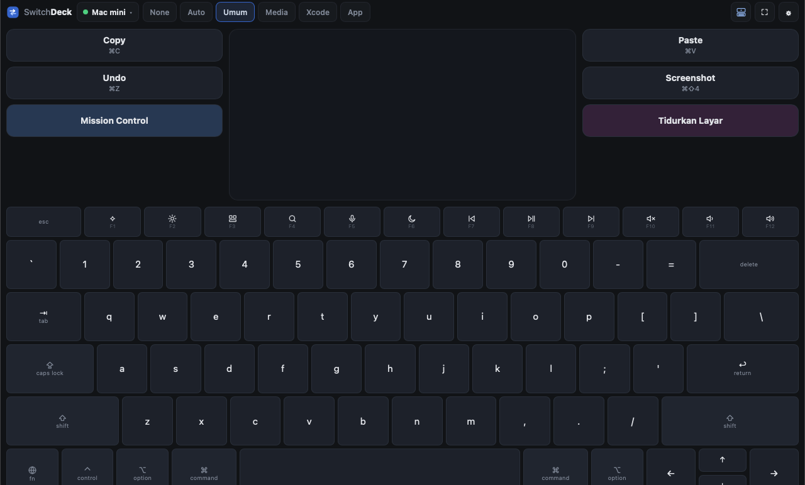
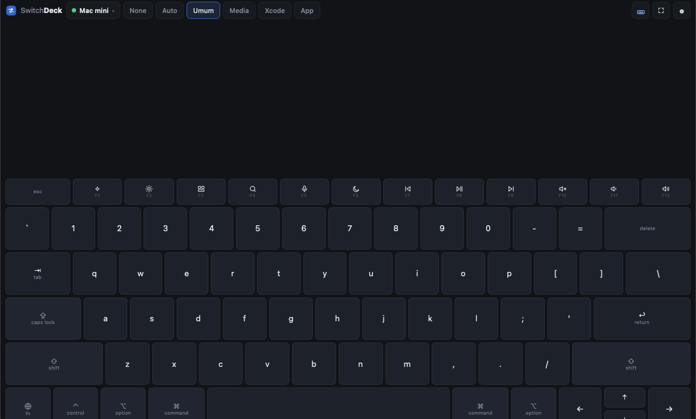
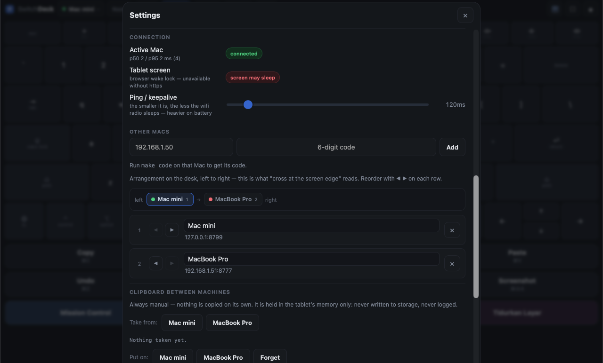
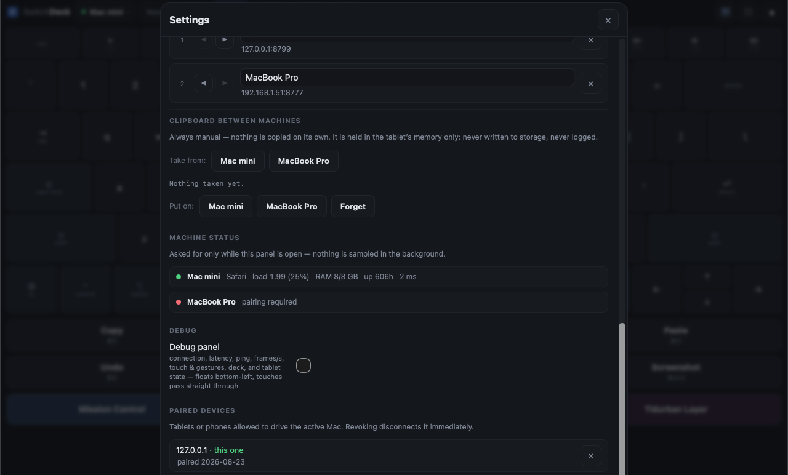
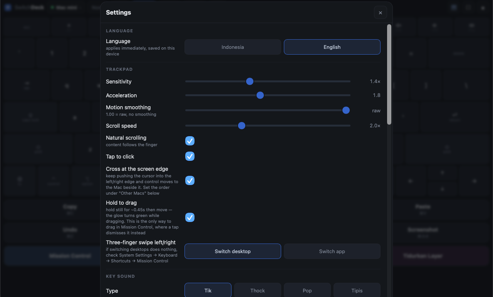
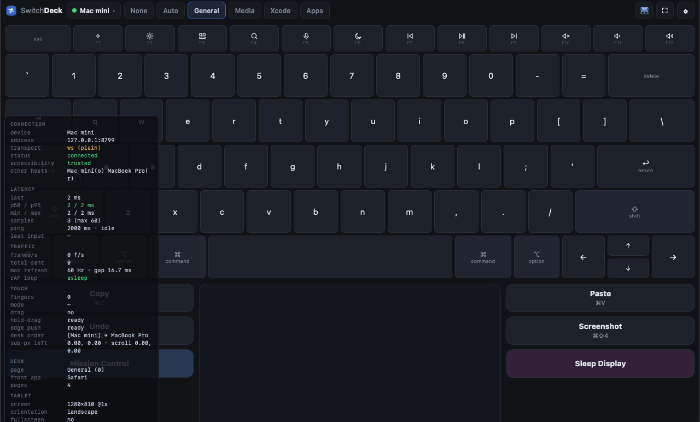

# SwitchDeck

Turn an Android tablet into a **trackpad, keyboard and macro deck** for a Mac — through the browser, with nothing to install on the tablet.

One tablet can drive **several Macs at once**: all of them stay connected, and control crosses over by pushing the cursor into the edge of the screen.



> 🇮🇩 **Bahasa Indonesia:** [README.id.md](README.id.md) · 📖 HTML version with larger images: open **[docs/index.html](docs/index.html)** in a browser.

---

## Contents

1. [What it is, and what it is not](#what-it-is-and-what-it-is-not)
2. [Requirements](#requirements)
3. [Install on the Mac](#install-on-the-mac)
4. [macOS permissions](#macos-permissions)
5. [Connect the tablet (pairing)](#connect-the-tablet-pairing)
6. [The screen, part by part](#the-screen-part-by-part)
7. [Trackpad](#trackpad)
8. [Keyboard](#keyboard)
9. [Deck](#deck)
10. [Layouts](#layouts)
11. [Several devices at once](#several-devices-at-once)
12. [Clipboard between devices](#clipboard-between-devices)
13. [Device status](#device-status)
14. [Settings](#settings)
15. [Debug panel](#debug-panel)
16. [Add to home screen (PWA) & HTTPS](#add-to-home-screen-pwa--https)
17. [Start automatically with the Mac](#start-automatically-with-the-mac)
18. [When something goes wrong](#when-something-goes-wrong)
19. [`make` command reference](#make-command-reference)
20. [How it works inside](#how-it-works-inside)

---

## What it is, and what it is not

**It is:** a control surface. The tablet sends motion, keystrokes and button ids; the Mac carries them out.

**It is not:**

- **Not screen mirroring or remote desktop.** The Mac's screen is never sent to the tablet. If that is what you need, use Universal Control or VNC.
- **Not meant for use away from home.** It is built for a single local network.
- **Not a product for other people.** No accounts, no cloud, no multi-user.

---

## Requirements

| | |
|---|---|
| **Mac** | macOS with the Xcode command line tools (for `swift build`) and **Node.js 18+** |
| **Tablet / phone** | anything with a modern browser and a multi-touch screen |
| **Network** | tablet and Mac on the **same wifi**. Tailscale also works, at higher latency |

---

## Install on the Mac

```bash
git clone https://github.com/fadielse/switch-deck.git
cd switch-deck
make build      # compile the Swift helper (deckd-input)
make deps       # Node dependencies for the server (deckd)
make doctor     # check permissions and health
make deckd      # run the server
```

`make deckd` prints something like this:

```
Buka di tablet:  http://192.168.1.213:8777/
Kode pairing:    858417
```

Leave that terminal open. To have it start on its own whenever the Mac boots, see [Start automatically with the Mac](#start-automatically-with-the-mac).

---

## macOS permissions

SwitchDeck injects input, so macOS requires the **Accessibility** permission.

```bash
make doctor
```

If it reports `trusted : TIDAK`, open:

**System Settings → Privacy & Security → Accessibility**, and add this binary:

```
<repo-folder>/mac/deckd-input/.build/release/deckd-input
```

Press **+**, then in the file dialog press **⌘⇧G** and paste the path above — Finder hides the `.build` folder, so it cannot be reached by clicking through the list.

Two things that regularly cause confusion:

- **The permission belongs to the parent application.** If `deckd` is started from Terminal, it may be Terminal that needs to be allowed. If it is started by launchd (`make install`), the binary itself is what gets allowed. `make doctor` prints the process chain so you can see which one it actually is.
- **Restart `deckd` after granting the permission.** macOS does not hand it to a process that is already running.

Switching desktops and App Exposé also make macOS ask once for the **Automation** (System Events) permission.

---

## Connect the tablet (pairing)

1. Open the address printed by `make deckd` in the tablet's browser, for example `http://192.168.1.213:8777/`.
2. Type the **6-digit code** printed in the terminal.
3. Tap **Pair**.



The code is single-use and rate-limited — repeated guesses are stalled immediately. Once it succeeds the tablet keeps its own token, so there is nothing to pair again.

Lost the code? `make code` prints a fresh one.

---

## The screen, part by part


Left to right along the top bar:

| Part | What it does |
|---|---|
| **SwitchDeck wordmark** | identity; the name hides on a narrow screen |
| **Device chip** | status dot plus the name of the device being driven. Tap it to switch (when there is more than one) |
| **Deck page tabs** | `None`, `Auto`, then a tab per page from `deck.json`. Scrolls sideways |
| **Layout button** | cycles through the four arrangements; the icon draws the one you are **currently** in |
| **⛶** | fullscreen |
| **⚙** | settings |

The top bar has a **fixed height** — it never grows, however long the app name in the `Auto` tab happens to be.

---

## Trackpad

The large area in the middle. A touch is confirmed by **a soft glow that follows the finger** — two fingers for scrolling means two glows.

| Gesture | Result |
|---|---|
| One finger, move | move the cursor |
| One finger, tap | left click |
| **Two quick taps** | **double click** — open a file, select a word |
| Two fingers, move | scroll |
| Two fingers, tap | right click |
| Tap, then press again and move | drag |
| **Hold still ~0.45s, then move** | **drag** — the glow turns **green** while it is active |
| Three fingers, swipe left/right | switch desktop (or switch app — selectable in settings) |
| Three fingers, swipe up | Mission Control |
| Three fingers, swipe down | App Exposé |

**Why hold-to-drag matters:** in Mission Control the first tap *selects a window and dismisses Mission Control*, so the "tap then press" gesture can never be used there. Hold-then-move is the only way to move a window between desktops from the tablet.

The trackpad **stays silent** — it is a surface, not a key. Sound belongs to the keyboard and the deck, where it stands in for the key travel glass cannot give.

---

## Keyboard

The layout follows the Apple Magic Keyboard (US): same key names, same widths, a function row at two-thirds height, and an inverted-T arrow cluster.

- **Modifiers are sticky**: tap to arm for one key, tap again to lock, tap again to release. They can also be **held down while another finger presses a letter**.
- **The function row has both roles**, exactly like the hardware: the printed action (brightness, volume, media) by default, and plain **F1–F12** while `fn` is on.
- **Caps Lock is a toggle on the tablet**, not a key that gets sent — macOS treats caps as a hardware state that cannot be set by an event.
- **Held keys repeat** (450 ms delay, then every 45 ms). Modifiers and media keys deliberately do not.
- Leaving the keyboard **releases every modifier**, so a modifier can never be left stuck on the Mac.

Typing is sent as **the literal character**, so the result does not depend on the Mac's own keyboard layout. Shortcuts are sent as **keycodes with the modifiers genuinely held down**, because a chord has to arrive as a chord.

---

## Deck

Macro buttons either side of the trackpad (in portrait: one grid across the top). Their contents come from:

```
~/.config/switchdeck/deck.json
```

That file is written on first run, and its App page is **filled only with applications that are actually installed** — so there are no dead buttons.

**Edit the file and every connected tablet redraws instantly** — no reconnect, no restart. A JSON typo leaves the last good deck on screen along with a warning, rather than emptying it.

### Shape of the file

```json
{
  "pages": [
    {
      "name": "General",
      "keys": [
        { "id": "copy", "label": "Copy", "hint": "⌘C",
          "action": { "type": "shortcut", "keys": ["cmd", "c"] } },
        { "id": "sleep", "label": "Sleep Display", "color": "#3a2440",
          "action": { "type": "shell", "command": "pmset", "args": ["displaysleepnow"] } }
      ]
    },
    {
      "name": "Xcode",
      "match": ["Xcode"],
      "keys": [
        { "id": "xc-build", "label": "Build", "hint": "⌘B",
          "action": { "type": "shortcut", "keys": ["cmd", "b"] } }
      ]
    }
  ]
}
```

### Fields per button

| Field | Required | Meaning |
|---|---|---|
| `id` | yes | unique name; this is the only thing the tablet ever sends |
| `label` | — | text on the button (defaults to `id`) |
| `hint` | — | small second line under the label |
| `color` | — | background colour, e.g. `#2c405c` |
| `host` | — | run it on **another device** — see [cross-device buttons](#buttons-that-run-on-another-device) |
| `action` | yes | what to carry out |

### Action types

| Type | Example |
|---|---|
| `shortcut` | `{ "type": "shortcut", "keys": ["cmd", "shift", "4"] }` |
| `text` | `{ "type": "text", "text": "me@example.com" }` |
| `media` | `{ "type": "media", "code": 16 }` — `NX_KEYTYPE_*` codes (play 16, next 17, previous 18, mute 7, volume up 0, volume down 1) |
| `open_app` | `{ "type": "open_app", "app": "Xcode" }` |
| `url` | `{ "type": "url", "url": "https://github.com" }` |
| `applescript` | `{ "type": "applescript", "script": "display notification \"hello\"" }` |
| `shell` | `{ "type": "shell", "command": "pmset", "args": ["displaysleepnow"] }` |

**`shell` takes a command plus an array of arguments, not a command line.** Nothing reaches a shell to be parsed again, so there is nowhere for injection to happen.

### Pages that follow the front app

Give a page a `match` field:

```json
{ "name": "Xcode", "match": ["Xcode", "com.apple.dt.Xcode"], "keys": [ ... ] }
```

It accepts app names or bundle ids. Then **select the `Auto` tab** on the tablet: the deck follows whatever is in front (Xcode comes forward → the Xcode page).

**Following the front app is a MODE, not the default behaviour.** A deck that rearranges itself while your hand is reaching for a button is worse than one that stays put, so choosing a page pins it. The `Auto` tab only appears when some page actually asks for an app.

Switching is debounced by 250 ms: alt-tabbing through three apps should land on the last one, not flicker through all three.

---

## Layouts

The layout button in the top bar cycles through four arrangements. The icons share one vocabulary: **two short lines mean keys, a dot means the trackpad.**

### 1. Trackpad only



The trackpad takes everything the deck does not need. With the deck page set to `None`, it really is the whole screen.

### 2. Keyboard above, trackpad below


The keyboard **shrinks** the trackpad rather than replacing it — the deck never leaves the screen.

### 3. Trackpad above, keyboard below



The same two halves, the other way up.

### 4. Keyboard only



The trackpad goes and the keyboard **drops to the bottom at the same size** it had in the previous mode — it does not stretch. A keyboard stretched over a whole tablet has rows taller than a thumb, which is harder to type on, not easier.

The chosen layout is remembered per device.

**Portrait is handled separately.** A tablet stood upright is a deck on its edge, not a laptop — palm rests either side of a trackpad make no sense at that width. So as soon as the tablet is turned, the deck becomes **one grid across the top** and the trackpad takes what is left. Nothing to configure; just turn it.

---

## Several devices at once

Every device is connected **at the same time**, but only one receives input at any moment. The tablet owns every connection — the devices never talk to each other, so one going down does not take the others with it.

### Adding a second device

On the new device: `make deckd`, then `make code` for its code. On the tablet: **⚙ → Other devices → enter the address and code → Add**.



### Desk order

The strip above the list draws the **physical** arrangement of the devices on your desk, left to right:

```
left   ● Mac mini 1  →  [● MacBook Pro 2]  →  ● mini PC 3   right
```

Reorder with the **◀ ▶** buttons on each row. The same number appears in the list, so the vertical list does not have to be imagined as a horizontal row.

This order is **not cosmetic** — it is what the crossing feature below reads.

### Crossing at the screen edge

Keep pushing the cursor into the right edge and control moves to the device to its right. The cursor appears on the far machine at the facing edge, at the same height, so the crossing reads as continuous.

To keep an ordinary bump against the edge from moving anything, **both** conditions must hold: about 90 px of motion swallowed **and** the push sustained for at least ~0.1 s. There is a 0.7 s pause afterwards. It can be switched off in settings.

If it refuses to cross, the **debug panel names the reason** (`crossing failed`): no device on that side, or that device is not connected.

### Buttons that run on another device

Give a deck button a `host` field:

```json
{ "id": "build", "label": "Build", "host": "MacBook Pro",
  "action": { "type": "shortcut", "keys": ["cmd", "b"] } }
```

That button always runs on the device it names, whichever one you are driving — build on the Mac mini while you carry on typing on the MacBook.

Two things follow from the rule that the tablet sends an id and never a command:

- **The id is resolved on the machine it reaches.** `host: "MacBook Pro"` means *"run the macro called `build` over there"*, and the MacBook's own `deck.json` decides what `build` does. Each machine stays the authority on what its own ids mean.
- **The `action` beside `host` is what runs locally**, on the machine whose file this is. It is never sent anywhere.

`host` is matched against the name shown in the tablet's device list (or the address). The button is drawn with a **dashed border** and the target's name, and goes **dim** when that device is not connected.

---

## Clipboard between devices

**⚙ → Clipboard between devices.**



- **Take from** device X → the contents are held on the tablet.
- **Put on** device Y → the contents are written to that device's clipboard.

**Always manual, never automatic.** Automatic clipboard sync between devices sounds like convenience and is actually a leak — password managers put passwords on the clipboard, and copying those elsewhere unasked is invisible until it is too late.

The limits: **text only**, at most 16 KB, held in the **tablet's memory alone** (gone on reload, never written to storage), and **never logged** at any hop.

---

## Device status

**⚙ → Device status.** One row per device: the app in front, load, memory, uptime, latency, and whether Accessibility has been granted.

**Load is shown per core**, because that is the number meaning the same thing on a four-core laptop and a twelve-core desktop — which is the whole point of this view. It turns amber past 70%.

The figures are **only requested while the settings panel is open**. Nothing is sampled in the background.

---

## Settings



**Interface language** sits at the very top of the panel: Indonesia or English, applied immediately without a reload.

What does **not** change with it — and must not: **deck page names and deck button labels**. Those live in `deck.json` on the device and belong to whoever wrote them; renaming a button you wrote is not the app's business.

The starter deck it generates on first run *is* ours, so it is written in English (`General`, `Sleep Display`, `Wake Display`). An existing `deck.json` is never rewritten — to pick up the new starter deck, rename yours and restart `deckd`.

| Setting | Meaning |
|---|---|
| **Language** | Indonesia or English. Applies immediately, saved per device |
| **About → Version** | the version this client is running |
| **Sensitivity** | cursor movement multiplier |
| **Acceleration** | how much a fast movement multiplies the distance |
| **Motion smoothing** | `1.00` = raw, no smoothing; lower is smoother but adds 1–2 frames of lag |
| **Scroll speed** | two-finger scroll multiplier |
| **Natural scrolling** | content follows the finger |
| **Tap to click** | turn off if you click by accident |
| **Cross at the screen edge** | cursor handover between Macs |
| **Hold to drag** | hold still, then move, to drag |
| **Three-finger swipe left/right** | *Switch desktop* or *Switch app* |
| **Key sound** | type (Tik / Thock / Pop / Tipis) and volume; `0` = off. The trackpad stays silent by design |
| **Add to home screen** | see the PWA section below |
| **Ping / keepalive** | the smaller it is, the less the wifi radio sleeps — heavier on battery. When idle, the ping slows to 2 seconds on its own |
| **Other devices** | add, name, reorder, remove |
| **Clipboard between devices** | take / put |
| **Device status** | the state of each device |
| **Debug panel** | see below |
| **Paired tablets & phones** | devices allowed to drive the active one; revoking disconnects them at once |

Every setting is stored per device.

---

## Debug panel

**⚙ → Debug → Debug panel.** It floats at the bottom left, and **touches pass straight through it**.



| Group | Contents |
|---|---|
| **connection** | active device, address, transport (ws/wss), status, Accessibility, a summary of the others |
| **latency** | last rtt, p50/p95 (coloured by threshold), min/max, sample count, ping mode active/idle |
| **traffic** | frames per second, total sent, the Mac's refresh rate, animation-loop state |
| **touch** | finger count, mode, drag, gesture distance against its threshold, sub-pixel remainder |
| **deck** | active page, front app, page count |
| **tablet** | screen size, orientation, fullscreen, wake lock, secure context, audio state |

While it is off, this panel **costs nothing** — its timer exists only while the panel is open.

When something misbehaves, start here. Two rows answer most questions:

- **`crossing failed`** — why the cursor handover did not happen.
- **`injector refused`** — that Mac rejected a frame. Almost always means its Swift binary is older than the client talking to it (`git pull` without `make build`).

---

## Add to home screen (PWA) & HTTPS

**⚙ → Add to home screen.** It then runs without a browser bar, opened from an icon like any other app.

If the button does not appear, the panel says why rather than showing a dead button. In some browsers the route is the ⋮ menu → *Add to Home screen*.

**HTTPS is an improvement, not a gate.** The app is served on two ports at once:

```
http://<ip>:8777/      always available
https://<ip>:8778/     after `make cert`
```

Why bother? **Wake Lock** — keeping the tablet's screen awake — only works in a secure context. So if the tablet keeps falling asleep, that is the sign it is going over plain HTTP.

```bash
make cert     # create a local certificate
# then restart deckd and open https://<ip>:8778/ on the tablet
```

The server's `/setup` page walks through installing the CA certificate on the tablet.

---

## Start automatically with the Mac

```bash
make install      # install as a launchd service
make status       # check whether it is running
make uninstall    # remove it again
```

**Important:** launchd has no parent application to lend it the Accessibility permission. So the `deckd-input` binary must be allowed **directly**, not Terminal. `make doctor` prints the process chain to make it obvious which one actually needs ticking.

---

## When something goes wrong

| Symptom | Most likely cause |
|---|---|
| The cursor does not move at all | Accessibility. Run `make doctor` — if `trusted: TIDAK`, grant it and **restart** deckd |
| The tablet cannot open the address | Different network, or the Mac's firewall. Check with `make ip` |
| The pairing code is always wrong | The code is single-use. Get a fresh one with `make code` |
| The tablet screen keeps sleeping | You are on plain HTTP. Wake Lock needs HTTPS — `make cert` |
| A feature works on one device but not another | That device has not been rebuilt after `git pull`. The debug panel will show `injector refused` |
| Crossing at the edge does nothing | Check the desk order in **⚙ → Other devices**, and the `crossing failed` row in the debug panel |
| Three-finger gestures do not switch desktops | Check *System Settings → Keyboard → Shortcuts → Mission Control* is still enabled |
| A strange popup appears on a two-finger hold | That belongs to the browser, not to SwitchDeck. Try another browser — Vivaldi on Android, for instance, raises a QR popup the page cannot suppress |
| Double tap opens nothing | Make sure `make build` has been run; the click-count fix lives on the Swift side |

Still stuck? Turn on the **debug panel** and read the `connection` group — nearly every "why is it silent" question is answered there.

---

## `make` command reference

| Command | What it does |
|---|---|
| `make build` | compile the Swift helper |
| `make deps` | install Node dependencies |
| `make deckd` | run the server |
| `make doctor` | check permissions, process chain, health |
| `make code` | print a fresh pairing code |
| `make ip` | the Mac's address on the local network |
| `make cert` | create a certificate for HTTPS |
| `make install` / `make uninstall` | install / remove the launchd service |
| `make status` | service status |
| `make docs` | rebuild the HTML documentation from the README files |
| `make version` | check the version on screen matches package.json |
| **Tests** | |
| `make e2e` | the full chain, WebSocket → deckd → deckd-input |
| `make client` | every client-side check (no Mac, no build, no permission needed) |
| `make idle` | proves the client lets the CPU sleep |
| `make debug-panel` | proves the debug panel renders in every state, in both languages |
| `make dblclick` | proves a double tap becomes a real double click |
| `make selftest` | direct input-injection test |
| `make verify-copy` | full chain through to the macOS clipboard |
| `make latency` | measure latency |

---

## How it works inside

```
Tablet (browser)  ──WebSocket──▶  deckd (Node)  ──stdin JSON──▶  deckd-input (Swift)  ──▶  macOS
                                    │                                                       CGEvent
                                    └── deck.json, device tokens, pairing
```

Three processes, three responsibilities:

- **The web client** — all of the UI. Edited most often, needs no compilation.
- **`deckd` (Node)** — the router: WebSocket, tokens, deck, validation. **It does not know what a CGEvent is.**
- **`deckd-input` (Swift)** — the only part that touches macOS APIs. Every OS-specific line is confined here, so adding Windows later will not disturb the other two layers.

Contributions are welcome — see **[CONTRIBUTING.md](CONTRIBUTING.md)** for the setup, the tests to run, and the list of things deliberately left out. Agents working on this repository should read **[CLAUDE.md](CLAUDE.md)** first.

One rule has held from the beginning and has never been relaxed: **the tablet sends an id, not a command.** The tablet never learns what a button's `action` contains; it only knows the id and the label. Every frame is validated in `deckd` before it is passed on — non-finite numbers, out-of-range keycodes, unknown modifier names and over-long text are all rejected rather than quietly repaired.
